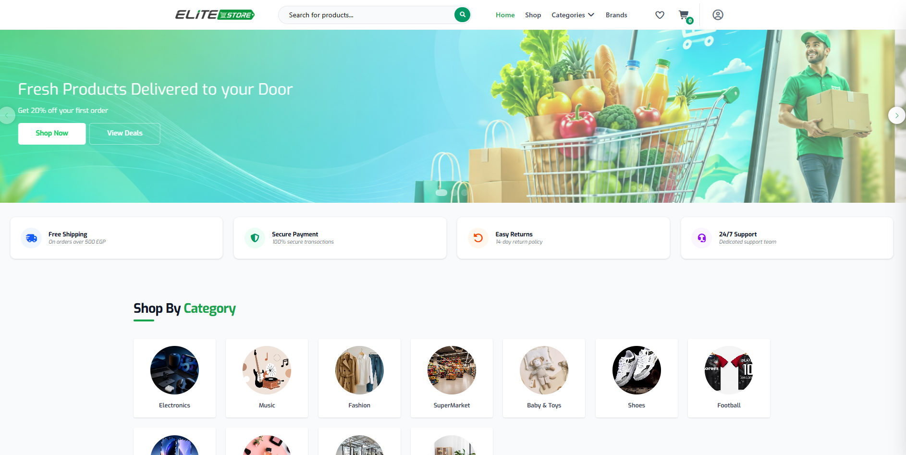
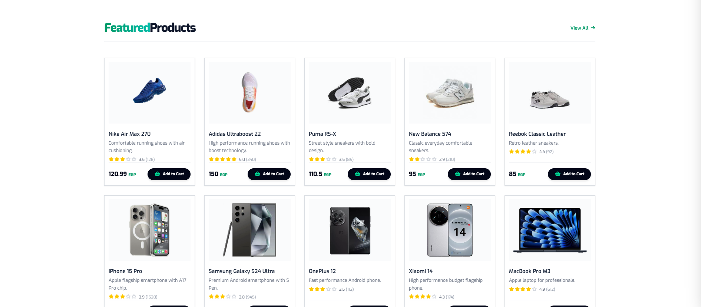
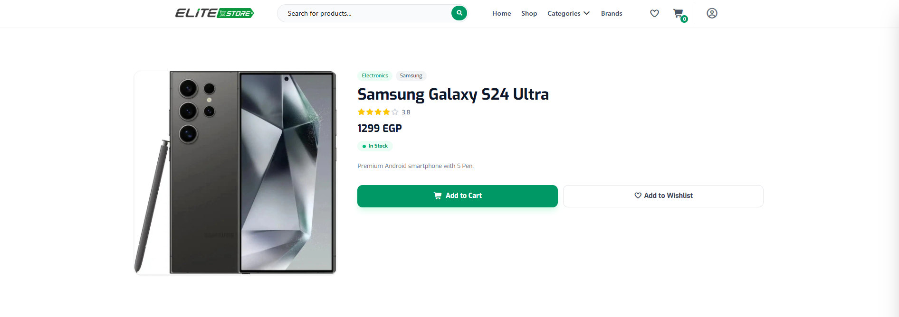
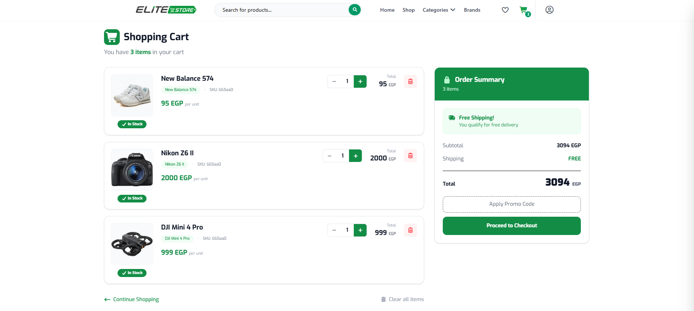
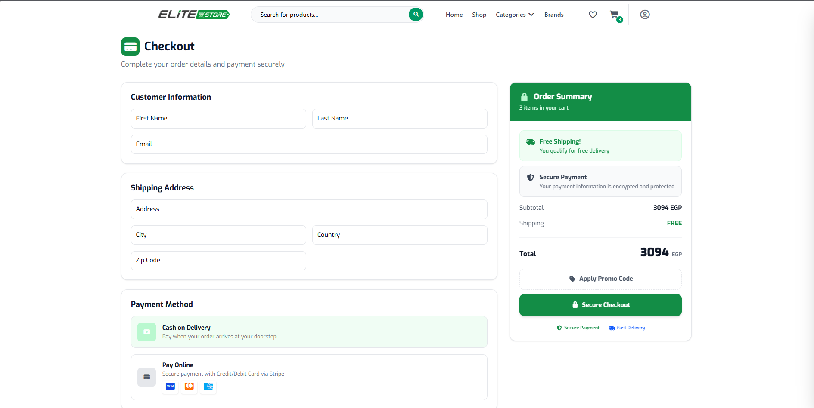

# E-Commerce Angular Frontend

Angular web client for an e-commerce microservices system. The application communicates with the backend through the API Gateway and provides the user interface for browsing products, managing the basket, authentication, and checkout.

## Website Screenshots

> Add your website screenshots inside `docs/images/` and update the image names if needed.

### Home Page

<div align="center">
  
</div>

### Products Page

<div align="center">
  
</div>

### Product Details Page

<div align="center">
  
</div>

### Basket Page

<div align="center">
  
</div>

### Checkout Page

<div align="center">
  
</div>

## Features

- Browse products
- View product details
- Filter products by category or brand
- User registration and login
- Add products to basket
- Update basket items
- Remove products from basket
- Checkout flow
- Integration with backend API Gateway
- Responsive UI

## Tech Stack

- Angular
- TypeScript
- HTML
- CSS / SCSS
- RxJS
- Angular Router
- Angular Forms
- HTTP Client

## Backend Integration

The Angular application communicates with the backend through the API Gateway.

| Backend Component | URL |
|---|---|
| API Gateway | `http://localhost:8020` |

Example environment configuration:

```ts
export const environment = {
  production: false,
  apiUrl: 'http://localhost:8020'
};
```

## Prerequisites

Make sure you have installed:

- Node.js
- npm
- Angular CLI
- Git

Install Angular CLI globally if needed:

```bash
npm install -g @angular/cli
```

## Getting Started

Clone the repository:

```bash
git clone <repository-url>
cd <repository-folder>
```

Install dependencies:

```bash
npm install
```

Start the development server:

```bash
ng serve
```

Open the application:

```txt
http://localhost:4200
```

## Available Scripts

| Command | Description |
|---|---|
| `npm install` | Install project dependencies |
| `ng serve` | Run the development server |
| `ng build` | Build the project |
| `ng test` | Run unit tests |
| `ng lint` | Run linting if configured |

## Build

Build the application for production:

```bash
ng build --configuration production
```

The build output will be generated in:

```txt
dist/
```

## Project Structure

```txt
src/
  app/
    core/
    shared/
    features/
      auth/
      catalog/
      basket/
      checkout/
      orders/
    app-routing.module.ts
    app.module.ts
  assets/
  environments/
    environment.ts
    environment.prod.ts
angular.json
package.json
README.md
```

> Update the structure if your project uses standalone components or a different folder layout.

## Main Pages

| Page | Description |
|---|---|
| Home | Landing page for the shop |
| Products | Displays products with categories and brands |
| Product Details | Shows detailed information for a selected product |
| Login | Authenticates existing users |
| Register | Creates a new user account |
| Basket | Displays selected products before checkout |
| Checkout | Collects order and payment information |
| Orders | Displays user orders if implemented |

## API Usage

Typical API calls are sent to the API Gateway:

```txt
GET    /products
GET    /products/{id}
GET    /categories
GET    /brands
POST   /auth/login
POST   /auth/register
GET    /basket/{userName}
POST   /basket
DELETE /basket/{userName}
POST   /basket/checkout
```

> Update these routes based on your actual backend controller paths.

## Environment Files

Development:

```txt
src/environments/environment.ts
```

Production:

```txt
src/environments/environment.prod.ts
```

Example:

```ts
export const environment = {
  production: false,
  apiUrl: 'http://localhost:8020'
};
```

## Deployment

Build the project:

```bash
ng build --configuration production
```

Deploy the generated files from the `dist/` folder to your hosting provider.

Common deployment options:

- IIS
- Nginx
- Netlify
- Vercel
- Firebase Hosting
- Docker

## Docker

Example Docker commands if the project includes a Dockerfile:

```bash
docker build -t ecommerce-angular-client .
docker run -p 4200:80 ecommerce-angular-client
```

## Troubleshooting

### API Requests Are Failing

Make sure the backend API Gateway is running and the `apiUrl` value is correct.

### CORS Error

Enable CORS in the backend API Gateway or backend services for the Angular application URL.

### Port Already In Use

Run Angular on another port:

```bash
ng serve --port 4300
```

### Dependencies Error

Delete installed packages and reinstall:

```bash
rm -rf node_modules package-lock.json
npm install
```

On Windows PowerShell:

```powershell
Remove-Item -Recurse -Force node_modules
Remove-Item -Force package-lock.json
npm install
```

## Future Improvements

- Add loading states and skeleton screens
- Add pagination
- Add advanced filters
- Add wishlist
- Add user profile page
- Add order tracking
- Add payment gateway integration
- Add unit and e2e tests
- Improve accessibility
- Add CI/CD pipeline

## License

This project is for educational and development purposes.
